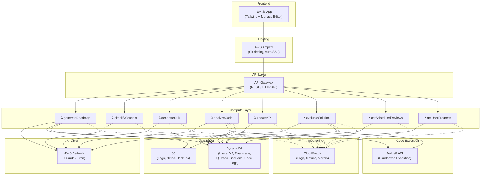
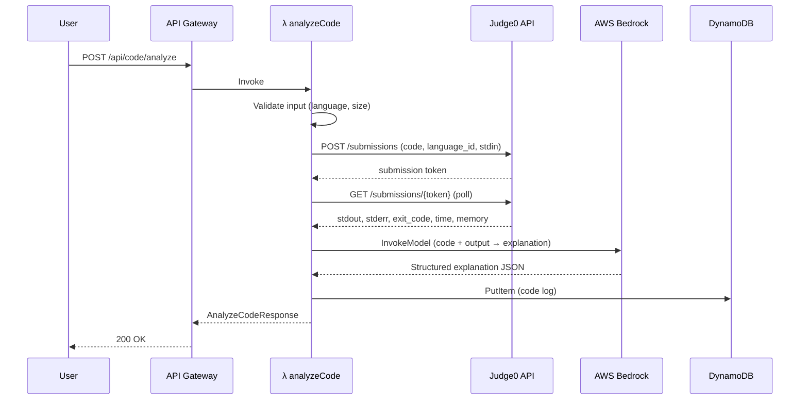
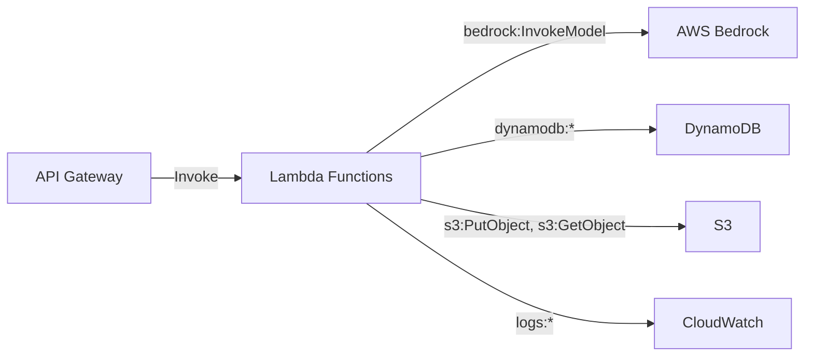

# Design Document: StuddyBuddy AI — AWS-Native Architecture

## Overview

StuddyBuddy AI is a serverless, AWS-native learning platform that combines generative AI, adaptive learning algorithms, and secure code execution to deliver personalized learning experiences for developers. The system uses AWS Bedrock for AI capabilities, DynamoDB for data persistence, Lambda for compute, and Judge0 for sandboxed code execution.

The architecture follows a fully serverless design — no servers to manage, auto-scaling by default, and cost-efficient under the AWS Free Tier / $100 credits budget. Every component is an AWS-managed service (except Judge0 for code execution), making it ideal for an AWS hackathon presentation.

---

## Architecture

### High-Level Architecture



### Request Flow

```
User (Browser)
  ↓
Next.js on AWS Amplify
  ↓
API Gateway (auth, rate-limit, validation)
  ↓
Lambda Function (business logic)
  ↓
┌──────────────┬──────────────┬──────────────┐
│ AWS Bedrock  │  DynamoDB    │  Judge0 API  │
│ (AI / Gen)   │  (Data)      │  (Code Exec) │
└──────────────┴──────────────┴──────────────┘
  ↓
CloudWatch (logs + metrics, automatic)
```

---

## Technology Stack

| Layer | Service | Purpose |
|---|---|---|
| **Frontend** | Next.js + Tailwind CSS + Monaco Editor | SSR, responsive UI, in-browser code editor |
| **Hosting** | AWS Amplify | Git-based deploy, auto-SSL, CDN |
| **API** | API Gateway (HTTP API) | REST endpoints, rate limiting, request validation |
| **Compute** | AWS Lambda (Node.js 20.x) | Serverless functions, auto-scaling, pay-per-use |
| **AI** | AWS Bedrock (Claude 3 Sonnet / Titan) | Roadmap gen, concept simplification, quiz gen, debug explanation |
| **Database** | DynamoDB | Users, XP, roadmaps, quizzes, sessions, code logs |
| **Code Execution** | Judge0 API | Sandboxed multi-language code execution |
| **Storage** | S3 | Logs, uploaded notes, backups |
| **Monitoring** | CloudWatch | Lambda logs, API errors, performance metrics, alarms |
| **Security** | IAM + API Gateway | Role-based access, no exposed keys, rate limiting |

---

## Components and Interfaces

### Lambda Functions

Each feature maps to one or more dedicated Lambda functions. All Lambdas share a common response format and error handling pattern.

#### Common Lambda Handler Pattern

```typescript
// Shared types across all Lambda functions
interface LambdaResponse<T> {
  statusCode: number
  body: {
    success: boolean
    data?: T
    error?: ErrorResponse
  }
}

interface ErrorResponse {
  code: string
  message: string
  userMessage: string
  suggestions?: string[]
  retryable: boolean
}
```

---

#### λ generateRoadmap

**Purpose**: Generate a personalized learning roadmap using Bedrock AI, store in DynamoDB.

```typescript
// POST /api/roadmap/generate
interface GenerateRoadmapRequest {
  userId: string
  goal: LearningGoal
  currentProficiency: ProficiencyMap
}

interface GenerateRoadmapResponse {
  roadmap: LearningPath
  estimatedTotalTime: number // minutes
}
```

**Flow**: API Gateway → Lambda → Bedrock (prompt: goal + proficiency → structured roadmap JSON) → DynamoDB (store roadmap) → S3 (backup)

**Bedrock Prompt Strategy**: System prompt defines the output JSON schema. User prompt includes the learning goal, current proficiency map, and preferred languages. Bedrock returns a structured `LearningPath` object with ordered concepts, prerequisites, and time estimates.

---

#### λ simplifyConcept

**Purpose**: Simplify complex concepts using Bedrock, adapted to user proficiency level.

```typescript
// POST /api/concept/simplify
interface SimplifyConceptRequest {
  conceptId: string
  conceptName: string
  proficiencyLevel: ProficiencyLevel
  context?: string
}

interface SimplifyConceptResponse {
  explanation: CodeExplanation
  relatedConcepts: string[]
  suggestedExercises: string[]
}
```

**Flow**: API Gateway → Lambda → Bedrock (prompt: concept + proficiency → explanation) → Response

**Bedrock Prompt Strategy**: For beginners, the prompt requests analogies, step-by-step breakdowns, and simple language. For advanced users, it focuses on architectural decisions, trade-offs, and edge cases.

---

#### λ generateQuiz

**Purpose**: Generate adaptive quiz questions using Bedrock, store quiz session in DynamoDB.

```typescript
// POST /api/quiz/generate
interface GenerateQuizRequest {
  userId: string
  conceptIds: string[]
  difficulty: number // 1-10
  numberOfQuestions: number // 5-20
}

interface GenerateQuizResponse {
  quizId: string
  questions: Exercise[]
  timeLimit: number // seconds
}
```

**Flow**: API Gateway → Lambda → DynamoDB (fetch user history for adaptive difficulty) → Bedrock (prompt: concepts + difficulty + history → quiz JSON) → DynamoDB (store quiz session) → Response

---

#### λ analyzeCode

**Purpose**: Accept user code, execute via Judge0, explain errors/output via Bedrock.

```typescript
// POST /api/code/analyze
interface AnalyzeCodeRequest {
  userId: string
  code: string
  language: string
  context?: string
}

interface AnalyzeCodeResponse {
  execution: {
    stdout: string
    stderr: string
    exitCode: number
    executionTime: number // ms
  }
  explanation: CodeExplanation
  patterns: Pattern[]
  suggestions: Improvement[]
}
```

**Flow**:
1. API Gateway → Lambda
2. Lambda → Judge0 API (execute code in sandbox)
3. Judge0 → Lambda (stdout, stderr, exit code)
4. Lambda → Bedrock (prompt: code + output + errors → explanation + patterns + suggestions)
5. Lambda → DynamoDB (store code log)
6. Lambda → Response

---

#### λ evaluateSolution

**Purpose**: Evaluate exercise solutions — run code via Judge0, assess via Bedrock, update XP.

```typescript
// POST /api/solution/evaluate
interface EvaluateSolutionRequest {
  userId: string
  exerciseId: string
  solution: string
  language: string
}

interface EvaluateSolutionResponse {
  correct: boolean
  testResults: TestResult[]
  feedback: string
  errorAnalysis?: ErrorExplanation
  xpAwarded: number
  newProficiency: ProficiencyLevel
}

interface TestResult {
  testCaseId: string
  passed: boolean
  input: any
  expectedOutput: any
  actualOutput: any
}
```

**Flow**: Lambda → Judge0 (run against test cases) → Bedrock (explain results) → DynamoDB (update XP + proficiency) → Response

---

#### λ updateXP

**Purpose**: Update user XP, level, streak, and badge data.

```typescript
// POST /api/xp/update
interface UpdateXPRequest {
  userId: string
  action: 'exercise_complete' | 'quiz_complete' | 'streak_bonus' | 'milestone'
  points: number
  metadata?: Record<string, any>
}

interface UpdateXPResponse {
  totalXP: number
  level: number
  streak: number
  newBadges: Badge[]
}
```

**Flow**: API Gateway → Lambda → DynamoDB (atomic update on XP, check level-up / badge thresholds) → Response

---

#### λ getScheduledReviews

**Purpose**: Retrieve concepts due for spaced-repetition review.

```typescript
// GET /api/reviews/{userId}
interface GetReviewsResponse {
  dueReviews: Review[]
  upcomingReviews: Review[]
}
```

**Flow**: API Gateway → Lambda → DynamoDB (query reviews where `scheduledFor <= now`) → Response

---

#### λ getUserProgress

**Purpose**: Retrieve comprehensive user progress data.

```typescript
// GET /api/progress/{userId}
interface GetProgressResponse {
  proficiencyMap: ProficiencyMap
  learningPaths: LearningPath[]
  recentActivity: LearningActivity[]
  stats: {
    totalXP: number
    level: number
    streak: number
    exercisesCompleted: number
    conceptsMastered: number
    timeInvested: number // minutes
  }
  knowledgeGaps: ConceptGap[]
}
```

**Flow**: API Gateway → Lambda → DynamoDB (batch get from multiple tables) → Response

---

## Data Models

### Core Domain Models

```typescript
// Learning path representation
interface LearningPath {
  id: string
  userId: string
  goal: LearningGoal
  concepts: ConceptNode[]
  estimatedDuration: number // minutes
  createdAt: string // ISO 8601
  progress: number // 0-100
}

interface LearningGoal {
  title: string
  description: string
  targetConcepts: string[]
  deadline?: string // ISO 8601
}

interface ConceptNode {
  conceptId: string
  name: string
  description: string
  order: number
  prerequisites: string[]
  estimatedTime: number // minutes
  status: 'not_started' | 'in_progress' | 'mastered'
  proficiencyRequired: ProficiencyLevel
}

// User proficiency tracking
interface ProficiencyMap {
  [conceptId: string]: ProficiencyData
}

type ProficiencyLevel = 'beginner' | 'intermediate' | 'advanced' | 'expert'

interface ProficiencyData {
  level: ProficiencyLevel
  confidence: number // 0-1
  lastAssessed: string // ISO 8601
  exercisesCompleted: number
  successRate: number // 0-1
}

// Exercise representation
interface Exercise {
  id: string
  conceptId: string
  difficulty: number // 1-10
  type: 'coding' | 'multiple_choice' | 'explanation' | 'debugging'
  prompt: string
  starterCode?: string
  testCases: TestCase[]
  hints: string[]
  successCriteria: string
  estimatedTime: number // minutes
}

interface TestCase {
  input: any
  expectedOutput: any
  isHidden: boolean
  description: string
}

// Code explanation
interface CodeExplanation {
  summary: string
  stepByStep: ExplanationStep[]
  concepts: string[] // concept IDs
  patterns: Pattern[]
  complexity: ComplexityAnalysis
  suggestions: string[]
}

interface ExplanationStep {
  lineRange: [number, number]
  explanation: string
  conceptsUsed: string[]
}

interface Pattern {
  name: string
  type: 'design_pattern' | 'architectural_pattern' | 'idiom' | 'anti_pattern'
  confidence: number // 0-1
  explanation: string
  alternatives?: string[]
}

interface ComplexityAnalysis {
  timeComplexity: string
  spaceComplexity: string
  cyclomaticComplexity: number
}

// Performance tracking
interface PerformanceMetrics {
  correct: boolean
  timeSpent: number // seconds
  hintsUsed: number
  attempts: number
  codeQuality?: number // 0-1
}

interface PerformanceHistory {
  recentExercises: ExerciseAttempt[]
  averageSuccessRate: number
  averageTime: number
  conceptStrengths: string[]
  conceptWeaknesses: string[]
}

interface ExerciseAttempt {
  exerciseId: string
  conceptId: string
  timestamp: string // ISO 8601
  metrics: PerformanceMetrics
}

// Spaced repetition
interface Review {
  conceptId: string
  scheduledFor: string // ISO 8601
  interval: number // days
  easeFactor: number // SM-2 algorithm
  repetitions: number
}

// Knowledge graph entities (stored as DynamoDB items, not Neo4j)
interface Concept {
  id: string
  name: string
  description: string
  category: string
  difficulty: number // 1-10
  estimatedLearningTime: number // minutes
  resources: LearningResource[]
  prerequisites: string[] // concept IDs
  relatedConcepts: string[] // concept IDs
}

interface LearningResource {
  type: 'article' | 'video' | 'documentation' | 'interactive'
  url: string
  title: string
  estimatedTime: number // minutes
}

// User preferences
interface UserPreferences {
  preferredLanguages: string[]
  learningStyle: 'visual' | 'textual' | 'interactive' | 'mixed'
  difficultyPreference: 'gradual' | 'challenging'
  sessionDuration: number // preferred minutes per session
  notificationsEnabled: boolean
}

// Gamification
interface Badge {
  id: string
  name: string
  description: string
  iconUrl: string
  earnedAt?: string // ISO 8601
}

// Error explanation (from Bedrock after Judge0 execution)
interface ErrorExplanation {
  errorType: 'syntax' | 'logic' | 'runtime' | 'edge_case' | 'performance'
  explanation: string
  suggestedFix: string
  relatedConcepts: string[]
}

interface Improvement {
  type: 'performance' | 'readability' | 'correctness' | 'maintainability'
  description: string
  suggestedCode?: string
  priority: 'low' | 'medium' | 'high'
}

// Contextual learning
interface CodeContext {
  code: string
  language: string
  errorMessage?: string
  fileName?: string
  projectType?: string
}

interface LearningSuggestion {
  conceptId: string
  reason: string
  relevance: number // 0-1
  estimatedTime: number // minutes
  priority: 'low' | 'medium' | 'high'
}

interface ConceptGap {
  conceptId: string
  conceptName: string
  currentLevel: ProficiencyLevel
  requiredLevel: ProficiencyLevel
  suggestedResources: LearningResource[]
}

interface LearningActivity {
  type: 'exercise' | 'quiz' | 'review' | 'code_analysis' | 'roadmap'
  timestamp: string // ISO 8601
  conceptId?: string
  duration: number // seconds
  result?: string
}
```

---

## DynamoDB Table Design

### Table: `Users`

| Attribute | Type | Key | Description |
|---|---|---|---|
| `PK` | String | Partition Key | `USER#<userId>` |
| `SK` | String | Sort Key | `PROFILE` |
| `email` | String | | User email |
| `displayName` | String | | Display name |
| `preferences` | Map | | `UserPreferences` object |
| `totalXP` | Number | | Cumulative XP |
| `level` | Number | | Current level |
| `streak` | Number | | Current daily streak |
| `lastActiveDate` | String | | ISO 8601 date |
| `createdAt` | String | | ISO 8601 timestamp |

### Table: `Roadmaps`

| Attribute | Type | Key | Description |
|---|---|---|---|
| `PK` | String | Partition Key | `USER#<userId>` |
| `SK` | String | Sort Key | `ROADMAP#<roadmapId>` |
| `goal` | Map | | `LearningGoal` object |
| `concepts` | List | | Array of `ConceptNode` |
| `progress` | Number | | 0-100 completion |
| `estimatedDuration` | Number | | Total minutes |
| `createdAt` | String | | ISO 8601 timestamp |

### Table: `Quizzes`

| Attribute | Type | Key | Description |
|---|---|---|---|
| `PK` | String | Partition Key | `USER#<userId>` |
| `SK` | String | Sort Key | `QUIZ#<quizId>` |
| `conceptIds` | List | | Concepts covered |
| `questions` | List | | Array of `Exercise` |
| `difficulty` | Number | | 1-10 |
| `score` | Number | | Final score (null if in-progress) |
| `status` | String | | `in_progress` / `completed` / `abandoned` |
| `startedAt` | String | | ISO 8601 timestamp |
| `completedAt` | String | | ISO 8601 timestamp (nullable) |

### Table: `Proficiency`

| Attribute | Type | Key | Description |
|---|---|---|---|
| `PK` | String | Partition Key | `USER#<userId>` |
| `SK` | String | Sort Key | `CONCEPT#<conceptId>` |
| `level` | String | | `beginner` / `intermediate` / `advanced` / `expert` |
| `confidence` | Number | | 0-1 |
| `exercisesCompleted` | Number | | Count |
| `successRate` | Number | | 0-1 |
| `lastAssessed` | String | | ISO 8601 timestamp |

### Table: `Reviews`

| Attribute | Type | Key | Description |
|---|---|---|---|
| `PK` | String | Partition Key | `USER#<userId>` |
| `SK` | String | Sort Key | `REVIEW#<conceptId>` |
| `scheduledFor` | String | | ISO 8601 timestamp |
| `interval` | Number | | Days until next review |
| `easeFactor` | Number | | SM-2 ease factor |
| `repetitions` | Number | | Review count |

**GSI**: `ScheduledFor-index` — partition key: `PK`, sort key: `scheduledFor` — enables efficient "get due reviews" queries.

### Table: `CodeLogs`

| Attribute | Type | Key | Description |
|---|---|---|---|
| `PK` | String | Partition Key | `USER#<userId>` |
| `SK` | String | Sort Key | `CODE#<timestamp>#<logId>` |
| `language` | String | | Programming language |
| `codeSnippet` | String | | Submitted code (truncated to 10KB) |
| `executionResult` | Map | | Judge0 stdout/stderr/exitCode |
| `explanation` | String | | Bedrock-generated explanation |
| `patterns` | List | | Identified patterns |

### Table: `XPHistory`

| Attribute | Type | Key | Description |
|---|---|---|---|
| `PK` | String | Partition Key | `USER#<userId>` |
| `SK` | String | Sort Key | `XP#<timestamp>` |
| `action` | String | | Action type |
| `points` | Number | | Points earned |
| `metadata` | Map | | Additional context |

### Table: `Concepts`

| Attribute | Type | Key | Description |
|---|---|---|---|
| `PK` | String | Partition Key | `CONCEPT#<conceptId>` |
| `SK` | String | Sort Key | `META` |
| `name` | String | | Concept name |
| `description` | String | | Description |
| `category` | String | | Category |
| `difficulty` | Number | | 1-10 |
| `prerequisites` | List | | Concept ID list |
| `relatedConcepts` | List | | Concept ID list |
| `resources` | List | | `LearningResource` array |

> **Note on Knowledge Graph**: Instead of Neo4j, concept relationships are stored as adjacency lists in DynamoDB (`prerequisites` and `relatedConcepts` arrays). For MVP, this is sufficient. Graph traversal (finding learning paths) is handled in Lambda code using BFS/DFS over the adjacency lists. If graph queries become complex post-MVP, consider adding Amazon Neptune.

---

## Code Execution Flow (Judge0 Integration)



### Judge0 Configuration

- **API**: Judge0 CE (Community Edition) or hosted RapidAPI
- **Supported Languages**: Python, JavaScript, Java, C++, Go, Rust (mapped to Judge0 `language_id`)
- **Limits**: Max code size 64KB, max execution time 10s, max memory 256MB
- **Polling**: Lambda polls Judge0 with 500ms intervals, max 20 retries (10s timeout)

---

## AI Layer — AWS Bedrock Integration

### Model Selection

| Use Case | Model | Rationale |
|---|---|---|
| Roadmap generation | Claude 3 Sonnet | Complex reasoning, structured output |
| Concept simplification | Claude 3 Sonnet | Natural language, adaptive tone |
| Quiz generation | Claude 3 Sonnet | Consistent question quality |
| Code analysis / explanation | Claude 3 Sonnet | Code understanding + explanation |
| Debug explanation | Claude 3 Sonnet | Error pattern recognition |

### Bedrock Invocation Pattern

```typescript
import { BedrockRuntimeClient, InvokeModelCommand } from '@aws-sdk/client-bedrock-runtime'

const bedrockClient = new BedrockRuntimeClient({ region: 'us-east-1' })

async function invokeBedrockModel(
  systemPrompt: string,
  userPrompt: string,
  maxTokens: number = 4096
): Promise<string> {
  const command = new InvokeModelCommand({
    modelId: 'anthropic.claude-3-sonnet-20240229-v1:0',
    contentType: 'application/json',
    accept: 'application/json',
    body: JSON.stringify({
      anthropic_version: 'bedrock-2023-05-31',
      max_tokens: maxTokens,
      system: systemPrompt,
      messages: [
        { role: 'user', content: userPrompt }
      ]
    })
  })

  const response = await bedrockClient.send(command)
  const responseBody = JSON.parse(new TextDecoder().decode(response.body))
  return responseBody.content[0].text
}
```

### Prompt Templates

Each Lambda uses a dedicated system prompt that:
1. Defines the exact JSON output schema expected
2. Includes guardrails (no harmful content, educational focus)
3. Specifies the user's proficiency level for tone adaptation
4. Requests structured output that can be parsed directly

Example system prompt for quiz generation:
```
You are an AI quiz generator for a developer learning platform.
Generate {n} multiple-choice questions about {concepts} at difficulty level {1-10}.
Output ONLY valid JSON matching this schema: [{ id, prompt, options: [{ label, text }], correctAnswer, explanation, conceptId, difficulty }]
```

---

## Error Handling

### Error Categories

**Client Errors (4xx)**:
- Invalid code syntax or unsupported language → `400 INVALID_INPUT`
- Rate limit exceeded → `429 RATE_LIMIT_EXCEEDED`
- Unauthorized request → `401 UNAUTHORIZED`

**Service Errors (5xx)**:
- Bedrock model unavailable → `503 AI_SERVICE_UNAVAILABLE`
- Judge0 execution timeout → `504 CODE_EXECUTION_TIMEOUT`
- DynamoDB throttling → `503 DATABASE_THROTTLED`

**Business Logic Errors**:
- Quiz already completed → `409 QUIZ_ALREADY_COMPLETED`
- No exercises available at difficulty → `404 NO_EXERCISES_AVAILABLE`

### Error Handling Strategy

```typescript
enum ErrorCode {
  // Client errors
  INVALID_INPUT = 'INVALID_INPUT',
  UNSUPPORTED_LANGUAGE = 'UNSUPPORTED_LANGUAGE',
  RATE_LIMIT_EXCEEDED = 'RATE_LIMIT_EXCEEDED',
  UNAUTHORIZED = 'UNAUTHORIZED',

  // Service errors
  AI_SERVICE_UNAVAILABLE = 'AI_SERVICE_UNAVAILABLE',
  CODE_EXECUTION_TIMEOUT = 'CODE_EXECUTION_TIMEOUT',
  CODE_EXECUTION_ERROR = 'CODE_EXECUTION_ERROR',
  DATABASE_THROTTLED = 'DATABASE_THROTTLED',
  DATABASE_ERROR = 'DATABASE_ERROR',

  // Business logic errors
  QUIZ_ALREADY_COMPLETED = 'QUIZ_ALREADY_COMPLETED',
  NO_EXERCISES_AVAILABLE = 'NO_EXERCISES_AVAILABLE',
  INSUFFICIENT_PROFICIENCY = 'INSUFFICIENT_PROFICIENCY'
}
```

**Recovery Strategies**:

| Error | Strategy |
|---|---|
| Bedrock unavailable | Retry 3× with exponential backoff (1s, 2s, 4s). Fallback: return cached/pre-generated content |
| Judge0 timeout | Return partial output + timeout message. Do not retry execution |
| DynamoDB throttled | Retry with exponential backoff. DynamoDB auto-scales on-demand tables |
| API Gateway 429 | Client receives retry-after header. No server-side retry |

**Lambda Error Middleware**:
All Lambdas wrap handlers in a shared error middleware that catches exceptions, maps them to `ErrorResponse`, and logs to CloudWatch.

---

## Security Model

### IAM Architecture



Each Lambda function has a **least-privilege IAM execution role**:

```json
{
  "Effect": "Allow",
  "Action": [
    "bedrock:InvokeModel"
  ],
  "Resource": "arn:aws:bedrock:us-east-1::foundation-model/anthropic.claude-3-sonnet-*"
}
```

### Security Controls

| Control | Implementation |
|---|---|
| **No exposed AI keys** | Bedrock uses IAM roles, no API keys needed |
| **Rate limiting** | API Gateway throttling: 100 req/s burst, 50 req/s sustained |
| **Input validation** | API Gateway request validators + Lambda-level validation |
| **Input size limits** | Code: max 64KB, prompts: max 4KB |
| **CORS** | API Gateway CORS configured for Amplify domain only |
| **Data encryption** | DynamoDB encryption at rest (AWS-managed KMS). S3 SSE-S3 |
| **No PII in logs** | CloudWatch structured logging, PII fields masked |
| **HTTPS only** | Amplify auto-SSL, API Gateway HTTPS endpoints |

---

## Monitoring & Observability (CloudWatch)

### Automatic Metrics

All Lambda functions automatically emit to CloudWatch:
- **Invocations**: Total function calls
- **Duration**: Execution time (p50, p95, p99)
- **Errors**: Function errors and throttles
- **ConcurrentExecutions**: Active instances

### Custom Metrics

```typescript
// Emitted from Lambda functions
const customMetrics = {
  'Bedrock/Latency': 'Time for Bedrock InvokeModel call',
  'Bedrock/TokensUsed': 'Input + output tokens per request',
  'Judge0/Latency': 'Time for code execution (submit + poll)',
  'Judge0/Errors': 'Failed executions count',
  'Quiz/Generated': 'Quizzes generated count',
  'XP/Awarded': 'XP points awarded'
}
```

### CloudWatch Alarms

| Alarm | Threshold | Action |
|---|---|---|
| Lambda error rate | > 5% over 5 min | SNS notification |
| Bedrock latency | p95 > 10s | SNS notification |
| DynamoDB throttles | > 0 over 1 min | SNS notification |
| API Gateway 5xx | > 1% over 5 min | SNS notification |

### Structured Logging

```typescript
// All Lambda logs follow this format
interface LogEntry {
  timestamp: string
  requestId: string
  userId: string
  function: string
  level: 'INFO' | 'WARN' | 'ERROR'
  message: string
  duration?: number
  metadata?: Record<string, any>
}
```

---

## Testing Strategy

### Unit Tests (Local)

- Test each Lambda handler in isolation with mocked AWS SDK clients
- Mock Bedrock responses, DynamoDB calls, and Judge0 API
- Framework: Jest with `aws-sdk-client-mock`
- Each Lambda has its own test file: `__tests__/generateRoadmap.test.ts`

### Integration Tests

- Deploy to a `dev` stage in API Gateway
- Test end-to-end flows: API Gateway → Lambda → DynamoDB
- Use DynamoDB Local for local integration tests
- Judge0: use a test Judge0 instance or mock for CI

### Property-Based Tests

- Framework: `fast-check` for TypeScript
- Minimum 100 iterations per property
- Custom generators for domain objects

### Load Testing

- Use Artillery or AWS Step Functions load test
- Target: API Gateway endpoints
- Validate Lambda concurrency and DynamoDB auto-scaling

---

## Deployment Architecture

### Infrastructure as Code

Use **AWS SAM** (Serverless Application Model) or **AWS CDK** for infrastructure:

```yaml
# template.yaml (SAM)
AWSTemplateFormatVersion: '2010-09-09'
Transform: AWS::Serverless-2016-10-31

Globals:
  Function:
    Runtime: nodejs20.x
    Timeout: 30
    MemorySize: 256
    Environment:
      Variables:
        DYNAMODB_TABLE_PREFIX: studdybuddy
        BEDROCK_MODEL_ID: anthropic.claude-3-sonnet-20240229-v1:0
        JUDGE0_API_URL: https://judge0-ce.p.rapidapi.com

Resources:
  GenerateRoadmapFunction:
    Type: AWS::Serverless::Function
    Properties:
      Handler: functions/generateRoadmap.handler
      Events:
        Api:
          Type: HttpApi
          Properties:
            Path: /api/roadmap/generate
            Method: POST

  # ... other Lambda functions follow same pattern

  UsersTable:
    Type: AWS::DynamoDB::Table
    Properties:
      TableName: studdybuddy-users
      BillingMode: PAY_PER_REQUEST
      AttributeDefinitions:
        - AttributeName: PK
          AttributeType: S
        - AttributeName: SK
          AttributeType: S
      KeySchema:
        - AttributeName: PK
          KeyType: HASH
        - AttributeName: SK
          KeyType: RANGE

  # ... other DynamoDB tables
```

### Deployment Pipeline

```
Git Push → Amplify (frontend auto-deploy)
Git Push → SAM deploy (backend Lambda + API Gateway + DynamoDB)
```

### Environments

| Environment | Purpose |
|---|---|
| `dev` | Local testing with SAM Local + DynamoDB Local |
| `staging` | Full AWS deployment, test data |
| `prod` | Production, real users |

---

## Cost Estimation (MVP on $100 Credits)

| Service | Estimated Monthly Cost |
|---|---|
| Lambda (100K invocations) | ~$0.20 |
| API Gateway (100K requests) | ~$0.10 |
| DynamoDB (on-demand, low traffic) | ~$1.00 |
| Bedrock (Claude 3 Sonnet, ~500 calls) | ~$5-15 |
| S3 (< 1GB) | ~$0.02 |
| Amplify (hosting) | ~$0 (free tier) |
| CloudWatch (basic) | ~$0 (free tier) |
| **Total** | **~$6-17/month** |

> With $100 AWS credits, this stack comfortably runs for **6-12 months** at MVP traffic.

---

## Correctness Properties

*A property is a characteristic or behavior that should hold true across all valid executions of a system—essentially, a formal statement about what the system should do. Properties serve as the bridge between human-readable specifications and machine-verifiable correctness guarantees.*

### Property Reflection

After analyzing all 75 acceptance criteria, I identified several areas of redundancy:

1. **Required field properties**: Many criteria check that certain fields are present (time estimates, success criteria, explanations). These can be consolidated into comprehensive data model validation properties.

2. **State update properties**: Multiple criteria verify that state is updated after actions (proficiency updates, progress tracking). These can be combined into general state consistency properties.

3. **Performance properties**: Several criteria specify response time limits (3s, 5s). These can be consolidated into a single performance property with different thresholds.

4. **Content generation properties**: Many criteria verify that explanations, hints, or suggestions are generated. These can be grouped by generation type.

After consolidation, the following properties provide comprehensive coverage without redundancy:

### Learning Path Properties

**Property 1: Learning path prerequisite completeness**
*For any* learning goal and knowledge graph, the generated learning path must include all transitive prerequisites for the target concept, ordered such that each concept appears after all its prerequisites.
**Validates: Requirements 1.1, 1.4**

**Property 2: Learning path respects mastered concepts**
*For any* user with mastered concepts and any learning goal, the generated learning path must exclude all concepts marked as mastered by that user.
**Validates: Requirements 1.3**

**Property 3: Learning path proficiency assessment**
*For any* generated learning path, the system must have assessed the user's proficiency for all concepts in the path before generation completes.
**Validates: Requirements 1.2**

**Property 4: Learning path metadata completeness**
*For any* generated learning path, every concept node must include a non-zero estimated time and a valid proficiency level requirement.
**Validates: Requirements 1.5**

### Code Explanation Properties

**Property 5: Code explanation generation**
*For any* syntactically valid code in a supported language, the code explainer must generate an explanation containing at least a summary and identified concepts.
**Validates: Requirements 2.1, 2.2**

**Property 6: Explanation detail adapts to proficiency**
*For any* code sample, the explanation generated for a beginner proficiency level must contain more words and more analogies than the explanation for an advanced proficiency level.
**Validates: Requirements 2.3, 2.4**

**Property 7: Complex code gets step-by-step breakdown**
*For any* code with cyclomatic complexity above a threshold, the explanation must include step-by-step components covering different sections of the code.
**Validates: Requirements 2.5**

**Property 8: Anti-pattern detection**
*For any* code containing known anti-patterns, the explanation must identify and describe at least one issue or anti-pattern.
**Validates: Requirements 2.6**

### Exercise Generation and Adaptation Properties

**Property 9: Exercise difficulty matches proficiency**
*For any* concept and user proficiency level, generated exercises must have difficulty ratings within an appropriate range for that proficiency level (beginner: 1-3, intermediate: 4-6, advanced: 7-10).
**Validates: Requirements 3.1**

**Property 10: Difficulty increases after success**
*For any* sequence of successfully completed exercises for a concept, the difficulty of each subsequent exercise must be greater than or equal to the previous exercise difficulty.
**Validates: Requirements 3.2**

**Property 11: Difficulty decreases after struggle**
*For any* exercise failure, the next generated exercise for the same concept must have lower difficulty than the failed exercise.
**Validates: Requirements 3.3**

**Property 12: Exercise completeness**
*For any* generated exercise, it must include a non-empty prompt, success criteria, and at least one test case.
**Validates: Requirements 3.4**

### Contextual Learning Properties

**Property 13: Suggestions for unfamiliar patterns**
*For any* code context containing concepts where the user's proficiency is beginner or not assessed, the system must generate at least one learning suggestion related to those concepts.
**Validates: Requirements 4.1**

**Property 14: Error explanation generation**
*For any* code context with an error message, the system must generate an explanation of the error and suggest at least one related learning resource.
**Validates: Requirements 4.2**

**Property 15: Knowledge gap identification**
*For any* code context and user profile, if the context requires concepts the user has not mastered, those concepts must be identified as knowledge gaps.
**Validates: Requirements 4.3**

**Property 16: Suggestion relevance ordering**
*For any* set of learning suggestions for a context, suggestions must be ordered by relevance score in descending order.
**Validates: Requirements 4.4**

**Property 17: Accepted suggestions integrate into learning path**
*For any* learning suggestion that a user accepts, the suggested concept must appear in the user's active learning path after acceptance.
**Validates: Requirements 4.5**

### Progress Tracking Properties

**Property 18: Exercise completion updates proficiency**
*For any* completed exercise, the user's proficiency data for the exercise's concept must be updated with new performance metrics.
**Validates: Requirements 5.1, 8.5**

**Property 19: Progress information completeness**
*For any* progress request, the response must include mastery percentage, time invested, and estimated time remaining for each concept in the learning path.
**Validates: Requirements 5.2, 5.5**

**Property 20: Mastery detection**
*For any* concept where a user has completed at least 5 exercises with 90% or higher success rate, the concept must be marked as mastered.
**Validates: Requirements 5.3**

**Property 21: Inactive concept review scheduling**
*For any* concept that was last practiced more than 30 days ago and is not mastered, a review suggestion must be generated.
**Validates: Requirements 5.4**

### Knowledge Graph Properties

**Property 22: Related concepts retrieval**
*For any* concept in the knowledge graph, requesting related concepts must return at least the direct prerequisites and direct dependents of that concept.
**Validates: Requirements 6.1**

**Property 23: Relationship type inclusion**
*For any* concept relationship returned, the response must include the relationship type (prerequisite, related, advanced_version, alternative, or applies_to).
**Validates: Requirements 6.2**

**Property 24: Concept addition to learning path**
*For any* concept in the knowledge graph, the system must provide an operation to add that concept to the user's learning path.
**Validates: Requirements 6.3**

**Property 25: Mastered concept highlighting**
*For any* knowledge graph visualization, concepts that the user has mastered must be visually distinguished from non-mastered concepts.
**Validates: Requirements 6.4**

**Property 26: Visual relationship representation**
*For any* concept relationship query, the system must provide a visual representation (graph, diagram, or structured format) of the connections.
**Validates: Requirements 6.5**

### Pattern Recognition Properties

**Property 27: Pattern identification**
*For any* code containing at least one instance of a known design pattern or architectural pattern, the code explainer must identify at least one pattern.
**Validates: Requirements 7.1**

**Property 28: Pattern explanation completeness**
*For any* identified pattern, the explanation must include the pattern name, purpose, and benefits.
**Validates: Requirements 7.2**

**Property 29: Pattern alternatives provision**
*For any* pattern explanation, the system must provide at least one alternative implementation approach.
**Validates: Requirements 7.3**

**Property 30: Misapplied pattern detection**
*For any* code containing a misapplied pattern (pattern used in inappropriate context), the explanation must identify the misapplication and suggest corrections.
**Validates: Requirements 7.4**

**Property 31: Pattern familiarity tracking**
*For any* pattern encountered by a user, if the same pattern is encountered again, the familiarity count for that pattern must increase.
**Validates: Requirements 7.5**

### Spaced Repetition Properties

**Property 32: Initial review scheduling**
*For any* concept marked as mastered, a review must be scheduled for exactly 1 day after the mastery timestamp.
**Validates: Requirements 8.1**

**Property 33: Review interval growth after success**
*For any* successful review of a concept, the next review interval must be strictly greater than the previous interval.
**Validates: Requirements 8.2**

**Property 34: Review interval reduction after failure**
*For any* failed review of a concept, the next review interval must be strictly less than the previous interval.
**Validates: Requirements 8.3**

**Property 35: Due review notification**
*For any* review scheduled for a date/time that has passed, a notification must exist for that review.
**Validates: Requirements 8.4**

### Multi-Modal Learning Properties

**Property 36: Text explanation presence**
*For any* concept explanation, the response must include a text-based explanation component.
**Validates: Requirements 9.1**

**Property 37: Visual concept diagram generation**
*For any* concept marked as benefiting from visualization, the explanation must include a diagram or visual representation.
**Validates: Requirements 9.2**

**Property 38: Example language matching**
*For any* code example generated for a user, the programming language must match the user's preferred language from their profile.
**Validates: Requirements 9.3**

**Property 39: Interactive demonstrations for complex concepts**
*For any* concept with difficulty rating above 7, the teaching materials must include an interactive demonstration option.
**Validates: Requirements 9.4**

**Property 40: Video resource suggestions for video learners**
*For any* user with learning style preference set to "visual" or "video", concept explanations must include at least one video resource when available.
**Validates: Requirements 9.5**

### Collaborative Learning Properties

**Property 41: Solution sharing availability**
*For any* completed exercise, the system must provide an operation to share the solution.
**Validates: Requirements 10.1**

**Property 42: Community solutions display**
*For any* exercise with at least one shared solution, viewing the exercise must display anonymized community solutions.
**Validates: Requirements 10.2**

**Property 43: Solution trade-off analysis**
*For any* set of alternative solutions displayed, each solution must include analysis of trade-offs in at least two dimensions (performance, readability, correctness, maintainability).
**Validates: Requirements 10.3, 10.5**

**Property 44: Exemplar solution highlighting**
*For any* solution that meets exemplar criteria (high code quality score and efficient approach), it must be marked as an exemplar in the display.
**Validates: Requirements 10.4**

### Error Analysis Properties

**Property 45: Error type identification**
*For any* incorrect solution submission, the evaluation must identify and return a specific error type (logic error, syntax error, edge case failure, performance issue, etc.).
**Validates: Requirements 11.1**

**Property 46: Error explanation provision**
*For any* identified error, the feedback must include an explanation of why the approach was incorrect.
**Validates: Requirements 11.2**

**Property 47: Repeated error pattern detection**
*For any* user who makes the same error type 3 or more times, the system must generate a focused practice suggestion for the underlying concept.
**Validates: Requirements 11.3**

**Property 48: Hint generation for errors**
*For any* incorrect solution, the system must provide at least one hint that guides toward the correct solution.
**Validates: Requirements 11.4**

**Property 49: Follow-up exercise after correction**
*For any* corrected error (user submits correct solution after incorrect attempt), the system must generate a similar exercise to confirm understanding.
**Validates: Requirements 11.5**

### Technology Recommendation Properties

**Property 50: Technology recommendations for project goals**
*For any* project goal description, the system must recommend at least one relevant technology.
**Validates: Requirements 12.1**

**Property 51: Recommendation rationale inclusion**
*For any* technology recommendation, the response must include a rationale explaining why the technology is suitable.
**Validates: Requirements 12.2**

**Property 52: Technology trade-off comparison**
*For any* set of multiple technologies that solve the same problem, the recommendation must include a comparison of trade-offs between them.
**Validates: Requirements 12.3**

**Property 53: Skill-leveraging recommendation prioritization**
*For any* user with existing skills and any project goal, recommended technologies that leverage existing skills must be ranked higher than technologies requiring entirely new knowledge.
**Validates: Requirements 12.4**

**Property 54: Learning path inclusion with recommendations**
*For any* technology recommendation, the response must include a learning path to master that technology.
**Validates: Requirements 12.5**

### Project Integration Properties

**Property 55: Project suggestions after concept completion**
*For any* user who has completed at least 3 foundational concepts, the system must suggest at least one project idea that applies those concepts.
**Validates: Requirements 13.1**

**Property 56: Project guidance provision**
*For any* project start event, the system must provide guidance covering architecture and implementation approach.
**Validates: Requirements 13.2**

**Property 57: Targeted help for project challenges**
*For any* project challenge or question, the system must provide help that guides toward a solution without providing complete implementation.
**Validates: Requirements 13.3**

**Property 58: Milestone code review**
*For any* completed project milestone, the system must review the code and provide at least one improvement suggestion.
**Validates: Requirements 13.4**

**Property 59: Project mastery identification**
*For any* completed project, the system must identify at least one concept that the user demonstrated mastery of through the project.
**Validates: Requirements 13.5**

### Performance Properties

**Property 60: Code explanation response time**
*For any* code explanation request under 1000 lines of code, the initial response must be provided within 3 seconds.
**Validates: Requirements 14.1**

**Property 61: Learning path generation time**
*For any* learning path generation request, the complete path must be generated within 5 seconds.
**Validates: Requirements 14.2**

**Property 62: Exercise evaluation time**
*For any* exercise solution submission, the evaluation and feedback must be provided within 5 seconds.
**Validates: Requirements 14.3, 3.5**

**Property 63: Progress feedback for long operations**
*For any* operation that exceeds 2 seconds, the system must provide at least one progress update to the user before completion.
**Validates: Requirements 14.5**

### Privacy and Security Properties

**Property 64: Sensitive data non-persistence**
*For any* code submitted for analysis, after processing completes, the code must not be stored in any persistent storage unless explicitly saved by the user.
**Validates: Requirements 15.1**

**Property 65: Personal data encryption**
*For any* user progress data stored in DynamoDB, all personally identifiable information fields must be encrypted.
**Validates: Requirements 15.2**

**Property 66: Data deletion compliance**
*For any* user data deletion request, all associated user data must be removed from all DynamoDB tables and S3 buckets.
**Validates: Requirements 15.3**

**Property 67: Third-party transmission consent**
*For any* code analysis operation, if the user has not provided explicit consent for third-party services (Judge0), no code must be transmitted to external services.
**Validates: Requirements 15.4**

**Property 68: Solution anonymization**
*For any* shared solution, all identifying information (username, email, user ID) must be removed or replaced with anonymous identifiers.
**Validates: Requirements 15.5**

### Summary

These 68 properties provide comprehensive coverage of all testable acceptance criteria. Properties that were consolidated:
- Multiple "required field" checks combined into completeness properties
- Similar state update checks combined into general update properties
- Performance requirements with same thresholds combined
- Related generation requirements combined into single properties

Properties marked as "no" in prework (like load testing 14.4) are excluded as they require integration/load testing rather than property-based testing.
