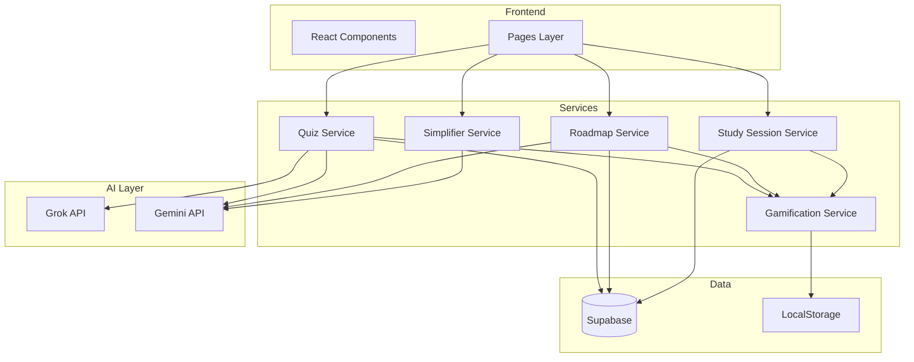

# Learnwise AI - Technical Design Document

## System Architecture

### High-Level Overview



---

## Technology Stack

| Layer | Technology | Version |
|-------|-----------|---------|
| Frontend | React | 19.2.3 |
| Language | TypeScript | 5.8.2 |
| Build Tool | Vite | 6.2.0 |
| Styling | TailwindCSS | 3.4.17 |
| Backend | Next.js | Latest |
| Database | Supabase | PostgreSQL |
| AI - Quiz | Grok API | xAI |
| AI - Other | Gemini API | Google |

---

## Database Design

### Tables

#### 1. learning_roadmaps
```sql
CREATE TABLE learning_roadmaps (
  id UUID PRIMARY KEY DEFAULT gen_random_uuid(),
  user_identifier TEXT NOT NULL,
  subject TEXT NOT NULL,
  skill_level TEXT CHECK (skill_level IN ('Beginner', 'Intermediate', 'Advanced')),
  target_timeline INTEGER,
  phases JSONB,
  current_phase INTEGER DEFAULT 1,
  progress JSONB DEFAULT '{"completed_tasks": [], "completion_percentage": 0}',
  status TEXT DEFAULT 'active',
  created_at TIMESTAMP DEFAULT NOW()
);
```

#### 2. concept_simplifications
```sql
CREATE TABLE concept_simplifications (
  id UUID PRIMARY KEY DEFAULT gen_random_uuid(),
  user_identifier TEXT NOT NULL,
  topic TEXT NOT NULL,
  explanation_level TEXT,
  simplified_explanation TEXT,
  examples JSONB,
  analogies JSONB,
  key_points JSONB,
  xp_earned INTEGER DEFAULT 10,
  created_at TIMESTAMP DEFAULT NOW()
);
```

#### 3. quiz_attempts
```sql
CREATE TABLE quiz_attempts (
  id UUID PRIMARY KEY DEFAULT gen_random_uuid(),
  user_identifier TEXT NOT NULL,
  subject TEXT,
  difficulty TEXT,
  total_questions INTEGER,
  correct_answers INTEGER,
  score_percentage DECIMAL(5,2),
  xp_earned INTEGER,
  created_at TIMESTAMP DEFAULT NOW()
);
```

#### 4. flashcard_sessions
```sql
CREATE TABLE flashcard_sessions (
  id UUID PRIMARY KEY DEFAULT gen_random_uuid(),
  user_identifier TEXT NOT NULL,
  subject TEXT,
  total_cards INTEGER,
  correct_count INTEGER,
  xp_earned INTEGER DEFAULT 5,
  created_at TIMESTAMP DEFAULT NOW()
);
```

#### 5. study_sessions
```sql
CREATE TABLE study_sessions (
  id UUID PRIMARY KEY DEFAULT gen_random_uuid(),
  user_identifier TEXT NOT NULL,
  duration_minutes INTEGER CHECK (duration_minutes IN (30, 60, 90)),
  topic TEXT,
  summary TEXT,
  xp_earned INTEGER,
  created_at TIMESTAMP DEFAULT NOW()
);
```

#### 6. streaks
```sql
CREATE TABLE streaks (
  id UUID PRIMARY KEY DEFAULT gen_random_uuid(),
  user_identifier TEXT UNIQUE,
  current_streak INTEGER DEFAULT 0,
  longest_streak INTEGER DEFAULT 0,
  last_activity_date DATE,
  freezes_available INTEGER DEFAULT 0,
  created_at TIMESTAMP DEFAULT NOW()
);
```

---

## Component Architecture

### Core Pages

1. **RoadmapPage** - Roadmap visualization and task tracking
2. **ConceptSimplifierPage** - Text input and AI simplification
3. **QuizPage** - Question display and navigation
4. **FlashcardPage** - Flashcard practice with flip animation
5. **DeepStudyPage** - Timer and focus mode
6. **Dashboard** - Central hub with progress widgets
7. **ResultsPage** - Quiz results and analytics

### Key Components

- **ProgressTracker** - Roadmap phase progress
- **StudyTimer** - Countdown timer
- **XPNotification** - XP gain animation
- **BadgeUnlockModal** - Badge celebration
- **LevelUpModal** - Level progression

---

## Service Layer

### 1. roadmapService.ts
```typescript
generateRoadmap(config: RoadmapConfig): Promise<LearningRoadmap>
updateProgress(roadmapId: string, taskId: string): Promise<void>
getActiveRoadmap(userId: string): Promise<LearningRoadmap>
```

### 2. simplifierService.ts
```typescript
simplifyContent(text: string, level: string): Promise<SimplificationResult>
getSavedSimplifications(userId: string): Promise<SimplificationResult[]>
```

### 3. quizService.ts
```typescript
generateQuiz(config: QuizConfig): Promise<Question[]>
submitQuiz(questions: Question[]): Promise<QuizResult>
```

### 4. flashcardService.ts
```typescript
generateFlashcards(subject: string, chapter: string): Promise<Flashcard[]>
saveSession(session: FlashcardSession): Promise<void>
```

### 5. studySessionService.ts
```typescript
startSession(duration: number, topic: string): Promise<string>
completeSession(sessionId: string, accomplishments: string): Promise<SessionSummary>
```

### 6. gamificationService.ts
```typescript
awardXP(source: XPSourceType, amount: number): void
checkLevelUp(): boolean
updateStreak(): void
unlockBadges(activity: ActivityType): Badge[]
```

---

## API Endpoints

### POST /api/roadmap/generate
**Request**: `{ subject, skillLevel, targetTimeline }`  
**Response**: `{ roadmap: {...} }`

### POST /api/simplify
**Request**: `{ text, level }`  
**Response**: `{ simplified, examples, analogies }`

### POST /api/quiz/generate
**Request**: `{ subject, chapters, difficulty }`  
**Response**: `{ questions: [...] }`

### POST /api/flashcards/generate
**Request**: `{ subject, chapter }`  
**Response**: `{ flashcards: [...] }`

### POST /api/study-session/complete
**Request**: `{ sessionId, accomplishments }`  
**Response**: `{ summary, nextActions, xpEarned }`

---

## AI Prompt Design

### Roadmap Generation
```typescript
const ROADMAP_PROMPT = `
Create a ${timeline}-day learning roadmap for ${subject} at ${level} level.
Output: JSON with phases, weekly breakdown, daily tasks.
`;
```

### Concept Simplification
```typescript
const SIMPLIFY_PROMPT = `
Simplify for ${level}: "${text}"
Provide: simplified explanation, 3 examples, 2 analogies, key points.
Output: JSON
`;
```

### Quiz Generation
```typescript
const QUIZ_PROMPT = `
Generate ${count} MCQs for ${subject} - ${chapters}.
Difficulty: ${difficulty}
Output: JSON array
`;
```

---

## Gamification Design

### XP Rewards
- Quiz: 10 (attempt) + 10 (complete) + 15 (perfect)
- Simplification: 10
- Flashcards: 5
- Study: 10/20/30 (30/60/90 min)
- Roadmap: 5 (task) + 50 (phase)

### Level Progression
```typescript
function calculateLevel(totalXP: number): number {
  // Level 1-10: 100 XP per level
  // Level 11+: Progressive scaling
}
```

### Streak Milestones
- 7 days: +50 XP, "Week Warrior" badge
- 14 days: +100 XP, 1 freeze
- 30 days: +200 XP, 2 freezes

---

## Implementation Roadmap

### Phase 1 (Week 1-2) - MVP
- [ ] Database schema setup
- [ ] RoadmapPage + RoadmapService
- [ ] ConceptSimplifierPage + SimplifierService
- [ ] QuizPage + QuizService
- [ ] DeepStudyPage + StudySessionService
- [ ] Core gamification (XP, levels, streaks)
- [ ] Dashboard with widgets

### Phase 2 (Week 3) - Enhancements
- [ ] FlashcardPage + FlashcardService
- [ ] Adaptive difficulty
- [ ] Advanced analytics
- [ ] Badge system expansion

### Phase 3 (Week 4) - Polish
- [ ] UI/UX refinements
- [ ] Performance optimization
- [ ] Testing
- [ ] Bug fixes

---

## Performance Targets

| Operation | Target |
|-----------|--------|
| Roadmap generation | < 5s |
| Concept simplification | < 3s |
| Quiz generation | < 4s |
| Page load | < 2s |
| Timer precision | ± 1s |

---

## Security

- API keys in environment variables
- Input sanitization before AI processing
- Rate limiting per user
- Data anonymization

---

**Version**: 1.0 | **Status**: Ready for Development
